<p align="center">
  
</p>

<h3 align="center">
  <samp>
    &gt; Salam, I am &nbsp;
    <b><a target="_blank" href="https://linkedin.com/in/mohamed-ayman-bouzagou">Mohamed Ayman Bouzagou</a></b>
  </samp>
</h3>

<br>

<p align="center">
<samp>
「 Full-Stack Developer building web platforms, desktop apps & embedded systems — powered by AI 」
</samp>
</p>

<p align="center">
  
</p>

<p align="center">
  
  <a href="https://github.com/mohamed-ayman-bouzagou?tab=followers">
    
  </a>
</p>

[](https://github.com/mohamed-ayman-bouzagou)

<p align="center">
  
</p>

<p align="center">
  <a href="https://linkedin.com/in/mohamed-ayman-bouzagou">
    
  </a>
</p>

<p align="center">
  <a href="#-featured-projects">
    
  </a>
  <a href="#-featured-projects">
    
  </a>
  <a href="#-ai--machine-learning-focus">
    
  </a>
</p>

[](https://github.com/mohamed-ayman-bouzagou)

<p align="center">
  
</p>

[](https://github.com/mohamed-ayman-bouzagou)

# 🛠 Technologies, Projects, and Domains

<table border="0" cellspacing="10" cellpadding="0">
<tr>

<!-- LEFT: TECH ICONS -->
<td width="420" valign="top" align="center">

<h3>🛠 Technologies</h3>
<br>

<table align="center" cellspacing="0" cellpadding="6">
  <tr>
    <td align="center"></td>
    <td align="center"></td>
    <td align="center"></td>
    <td align="center"></td>
    <td align="center"></td>
  </tr>
  <tr>
    <td align="center"></td>
    <td align="center"></td>
    <td align="center"></td>
    <td align="center"></td>
    <td align="center"></td>
  </tr>
  <tr>
    <td align="center"></td>
    <td align="center"></td>
    <td align="center"></td>
    <td align="center"></td>
    <td align="center"></td>
  </tr>
  <tr>
    <td align="center"></td>
    <td align="center"></td>
    <td align="center"></td>
    <td align="center"></td>
    <td align="center"></td>
  </tr>
</table>

</td>

<!-- PROJECTS -->
<td width="260" valign="top" align="center">

<h3>🧪 Projects</h3>
<br>

| | Project | Stack |
|---|---|---|
| 🤖 | **Voice Robot** | `Arduino` `C` |
| 🏨 | **Hotel Desktop** | `Qt` `C++` |
| 🌐 | **Hotel Web** | `React` `Laravel` |
| ✅ | **TaskZen** | `React` `JS` |

</td>

<!-- AI DOMAINS -->
<td width="260" valign="top" align="center">

<h3>🧠 Focus Areas</h3>
<br>

```
├── 💻  Full-Stack Web Dev
├── 🖥️   Desktop (Qt/C++)
├── 🤖  Embedded Systems
├── 🧠  AI / ML Integration
├── 🗄️   Database Design
└── ☁️   Cloud & DevOps
```

</td>

</tr>
</table>

[](https://github.com/mohamed-ayman-bouzagou)

## 📊 Vital Statistics

<p align="center">
  
</p>

<p align="center">
  
</p>

<p align="center">
  
</p>

<p align="center">
  
</p>

<p align="center">
  
</p>

<p align="center">
  
</p>

<div align="center">
  <picture>
    <source media="(prefers-color-scheme: dark)" srcset="https://raw.githubusercontent.com/mohamed-ayman-bouzagou/mohamed-ayman-bouzagou/output/github-contribution-grid-snake-dark.svg">
    <source media="(prefers-color-scheme: light)" srcset="https://raw.githubusercontent.com/mohamed-ayman-bouzagou/mohamed-ayman-bouzagou/output/github-contribution-grid-snake.svg">
    
  </picture>
</div>

[](https://github.com/mohamed-ayman-bouzagou)

<table width="100%" border="0" cellspacing="10" cellpadding="0">
<tr>

<!-- LEFT: OPEN TO -->
<td width="33%" valign="top">

## 🤝 Open To

I'm open to collaborating on:

<ul>
  <li>Full-stack web projects</li>
  <li>AI-powered applications</li>
  <li>Embedded & robotics systems</li>
  <li>Desktop application development</li>
  <li><b>Internship — July 2026</b> ✅</li>
</ul>

</td>

<!-- MIDDLE: COLLAB PANEL -->
<td width="34%" align="center" valign="middle">
  <a href="mailto:mohamedaymanbouzagou@gmail.com">
    
  </a>
</td>

<!-- RIGHT: CONTACT -->
<td width="33%" valign="top" align="center">

## 📫 Contact

<br>

<a href="mailto:mohamedaymanbouzagou@gmail.com">
  
</a>
<br><br>

<a href="https://linkedin.com/in/mohamed-ayman-bouzagou">
  
</a>
<br><br>

<a href="https://github.com/mohamed-ayman-bouzagou">
  
</a>

</td>

</tr>
</table>

[](https://github.com/mohamed-ayman-bouzagou)

<p align="center">
⚡ Building the future — one commit at a time.
</p>
<p align="center">
Star ⭐ the repos if they helped you!
</p>

<p align="center">
  
</p>

<p align="center">
  ⭐️ From <a href="https://github.com/mohamed-ayman-bouzagou">mohamed-ayman-bouzagou</a>
</p>
